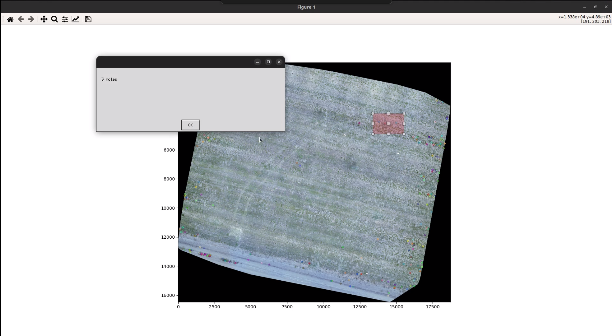
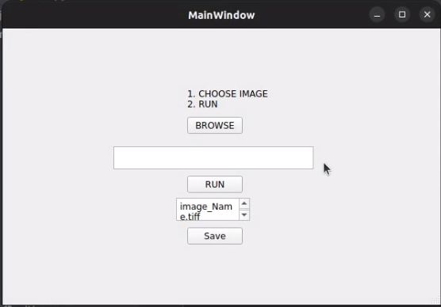

# Provably-Good-Holes-Searching

In our application, we are given a set of 2D RGB images that were collected from a remote-controlled drone
above a field or a similar ground. The goal is to have a system that automatically detect “holes” in these
image. More precisely, to return a subset of pixels in the given image, where each pixel is a center of such
a hole. 



# 1. Prerequisites:
We have tested the library in **Ubuntu 20.04**, and **Windows** but it should be easy to compile in other platforms.

## Building library and examples for WINDOWS:
## OpenCV
We use [OpenCV](http://opencv.org) to manipulate images and features. Dowload and install instructions can be found at: http://opencv.org.

## Python
Download and install instructions can be found at: https://www.python.org/downloads/windows/

## PILLOW
We use PIL for a larger selection of image file formats: JPEG, BMP, and TIFF image files;
Inter in cmd: ```pip install Pillow```

## Matplotlib
Download and install instructions can be found at: https://matplotlib.org/3.1.1/users/installing.html#building-on-windows

##2. Building library:
Download project then unzip the files 
OR 
Clone the repository:
```
git clone https://github.com/rbdlabhaifa/Provably-Good-Holes-Searching.git
```

# 3. Examples:
run:
```
python3 main.py
```

# 4. How to use:


Please see attached video in files.
1. Select an image. 
2. Press "Run" for running the algorithm. 
3. Wait untill the algorithm is finished. A window will pop up with the chosen image with circles around the circles.
4. When done, add a name to the image. 
5. Press on save button and will open a dialog file to choose the directory you want to  save the image in.

Zooming in/out:
You can zoom in and out by pressing on the magnifier icon on the top.

Selecting a suberea:
Do a mouse click at the origin of an erea you want to choose and drag the mouse to a destination point, release the button. 

This class gives click- and release-events and also draws a line or a box from the 
click-point to the actual mouse position (within the same axes) until the button is 
released. Within the method 'self.ignore()' it is checked whether the button from 
eventpress and eventrelease are the same.

